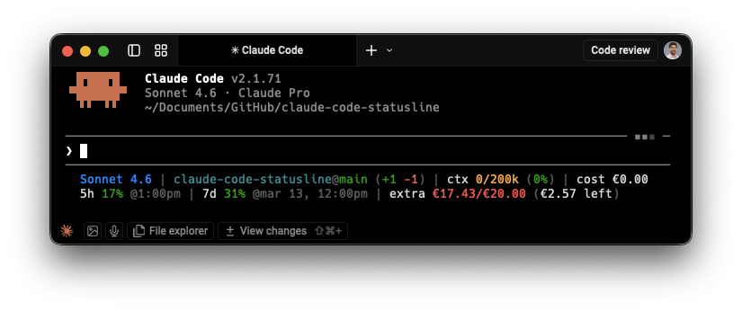
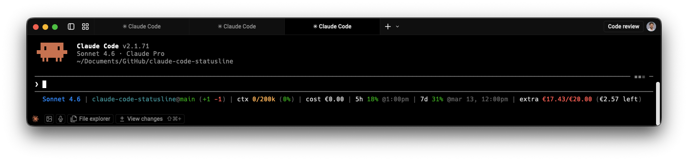
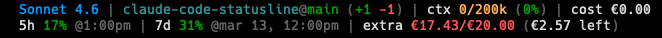

# claude-code-statusline

Model, git, token usage, session cost, and live plan limits — directly in your Claude Code status line.




**Install — tell Claude Code to do it:**

```
Download https://raw.githubusercontent.com/aleksander-dytko/claude-code-statusline/main/statusline.sh to ~/.claude/statusline.sh and register it as the statusLine command in ~/.claude/settings.json. Use the downloaded file exactly as-is — do not generate or modify it.
```

Then **restart Claude Code**. No API keys, no manual token setup.

---

## What it solves

Claude Code doesn't surface usage data inline — you have to switch to the web app to check your 5-hour session limit, weekly limit, or billing. This script puts all of that directly in the status line. No app switching, no manual token management, no extra setup.

---

## Background

This is Part 3 of a Claude Code series I've been writing for Product Managers — specifically about building an AI workspace where the AI already knows your project, your notes, and your context before you type a single word.

If you want to understand why this script exists and what it fits into:

- **[Your AI Has No Memory. Mine Does.](https://productpeak.substack.com/p/your-ai-has-no-memory-mine-does)** — the concept: why context beats prompts, and how to build a PM workspace where AI has persistent memory across sessions
- **[Your AI Still Has No Memory? Here's the Blueprint.](https://productpeak.substack.com/p/your-ai-still-has-no-memory-heres)** — the open-source [ai-pm-workspace](https://github.com/aleksander-dytko/ai-pm-workspace) template you can clone and personalize in five minutes

The statusline is what you reach for after that setup is in place. Once you live in Claude Code daily, the last remaining friction is not knowing your session limits without leaving the terminal. This script removes that.

---

## Layouts

**Default — single line:**



**Two-line mode** — separates inline data (model, git, context, cost) from API-fetched usage limits:



- **Line 1:** model · git branch/diff · context window · session cost
- **Line 2:** 5h session usage · 7d weekly usage · extra overage billing

Enable with:

```bash
export STATUSLINE_SPLIT_LINES=true
```

---

## Install

**Option 1 — Tell Claude Code to do it:**

```
Download https://raw.githubusercontent.com/aleksander-dytko/claude-code-statusline/main/statusline.sh to ~/.claude/statusline.sh and register it as the statusLine command in ~/.claude/settings.json. Use the downloaded file exactly as-is — do not generate or modify it.
```

**Option 2 — One-liner:**

```bash
curl -fsSL https://raw.githubusercontent.com/aleksander-dytko/claude-code-statusline/main/install.sh | bash
```

Then **restart Claude Code**.

### Requirements

- [Claude Code](https://github.com/anthropics/claude-code) (any version with `statusLine` support)
- macOS or Linux (Windows requires [WSL](https://learn.microsoft.com/en-us/windows/wsl/install))
- `bash`, `curl`, `jq`
  - macOS: `brew install jq`
  - Ubuntu/Debian: `sudo apt install jq`
- A Claude Pro or Max subscription (for the usage limits API)

---

## Segments

| Segment | Label | Source | Example |
|---------|-------|--------|---------|
| Model | none | stdin | `Sonnet 4.6` |
| Git | `dir@branch` | git | `project@main (+10 -3)` |
| Context window | `ctx` | stdin | `ctx 45k/200k (22%)` |
| Session cost | `cost` | stdin | `cost $0.07` |
| 5h session limit | `5h` or `⚡ 5h` | OAuth API | `5h 45% @4:30pm` |
| 7d weekly limit | `7d` or `⚡ 7d` | OAuth API | `7d 78% @mar 14, 11am` |
| Extra usage | `extra` or `extra ⚡` | OAuth API | `extra ⚡ €17.30/€20 (€2.70 left)` |

> **Worktrees**: When in a Claude Code worktree, the git segment shows `project[wt:name]@branch`.

> **Session cost**: This shows the equivalent API cost of your session's token usage. **Pro and Max subscribers are not charged this amount** — your usage is included in your subscription. The cost is informational, showing what the same usage would cost at API rates. See [Anthropic's cost docs](https://docs.anthropic.com/en/docs/claude-code/costs) for details.

---

## Color coding

| Segment | Green | Yellow | Red |
|---------|-------|--------|-----|
| Context window | < 50% | 50–75% | ≥ 75% |
| 5h session | < 70% | 70–90% | ≥ 90% |
| 7d weekly | < 70% | 70–90% | ≥ 90% |
| Extra usage spend | < 50% of limit | 50–80% | ≥ 80% |
| Session cost | white (informational) | — | — |

**⚡ rules:**
- `⚡ 5h` / `⚡ 7d` — that limit is at 100%, currently routing to extra billing
- `extra ⚡` — extra usage is actively being consumed because a plan limit is hit
- When at limit: shows `resets in Xh Ymin` countdown instead of wall clock

---

## Configuration

All settings are optional environment variables. Add them to your shell profile (`~/.zshrc`, `~/.bashrc`, or `~/.config/fish/config.fish`).

| Variable | Default | Description |
|----------|---------|-------------|
| `STATUSLINE_SHOW_GIT` | `true` | Show git repo, branch, and diff |
| `STATUSLINE_SHOW_CONTEXT` | `true` | Show context window token usage |
| `STATUSLINE_SHOW_SESSION_COST` | `true` | Show session cost from stdin |
| `STATUSLINE_SPLIT_LINES` | `false` | Split into 2 rows (stdin segments / API segments) |
| `STATUSLINE_SHOW_SESSION` | `true` | Show 5-hour session limit |
| `STATUSLINE_SHOW_WEEKLY` | `true` | Show 7-day weekly limit |
| `STATUSLINE_SHOW_EXTRA` | `true` | Show extra usage / overage billing |
| `STATUSLINE_CURRENCY_SYMBOL` | `$` | Currency prefix (set to `€` for Europe) |
| `STATUSLINE_CACHE_TTL` | `60` | Seconds between API refreshes |
| `STATUSLINE_CACHE_DIR` | `/tmp/claude` | Cache file directory |
| `CLAUDE_CODE_OAUTH_TOKEN` | _(auto)_ | Override OAuth token explicitly |

### Examples

```bash
# European billing
export STATUSLINE_CURRENCY_SYMBOL='€'

# Minimal — model + context only
export STATUSLINE_SHOW_GIT=false
export STATUSLINE_SHOW_SESSION_COST=false
export STATUSLINE_SHOW_SESSION=false
export STATUSLINE_SHOW_WEEKLY=false
export STATUSLINE_SHOW_EXTRA=false

# Refresh usage data every 2 minutes instead of 1
export STATUSLINE_CACHE_TTL=120
```

---

## How it works

Claude Code calls the status line script on every render, passing session context as JSON on stdin. The script reads the model name, context window usage, session cost, and current working directory from that JSON — no API call required for these segments.

Git information (branch name and diff stats) comes from running `git` commands against the current directory. Worktree names are read directly from stdin when available.

Usage limits (5-hour session, 7-day weekly, and extra overage) are fetched from the Anthropic API at `api.anthropic.com/api/oauth/usage`. The script auto-discovers your OAuth token from the macOS Keychain, a Linux credentials file, or the `CLAUDE_CODE_OAUTH_TOKEN` environment variable — the same token Claude Code itself uses. Responses are cached for 60 seconds so all terminal tabs share one API call.

See [docs/CONFIGURATION.md](docs/CONFIGURATION.md) for full configuration reference.

---

## Manual install

If you prefer not to pipe to bash:

```bash
curl -fsSL https://raw.githubusercontent.com/aleksander-dytko/claude-code-statusline/main/statusline.sh \
    -o ~/.claude/statusline.sh
chmod +x ~/.claude/statusline.sh
```

Then add to `~/.claude/settings.json`:

```json
{
  "statusLine": {
    "type": "command",
    "command": "bash ~/.claude/statusline.sh"
  }
}
```

---

## Troubleshooting

See [docs/TROUBLESHOOTING.md](docs/TROUBLESHOOTING.md).

---

## License

MIT — see [LICENSE](LICENSE).
